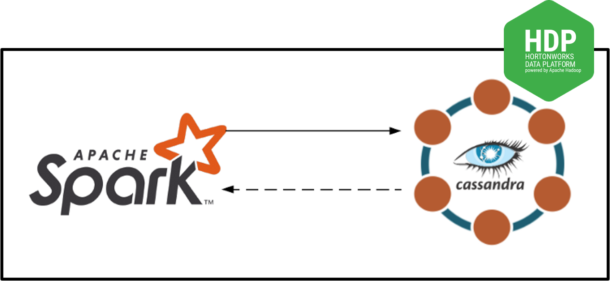
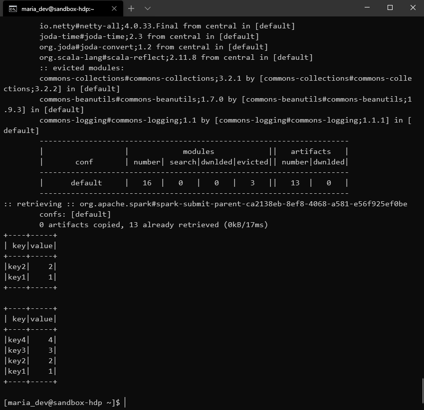
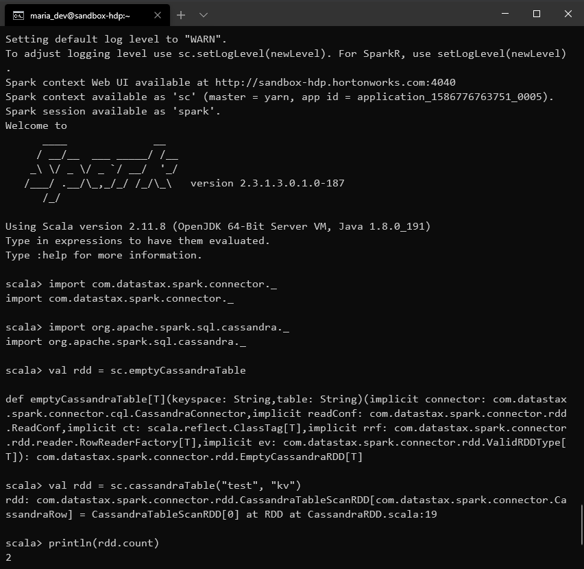

# cassandra-spark-hdp3
This repo will guide you in installing and integrating Cassandra
with Spark2 on Hortonworks HDP 3.0.1. Skip installing HDP 3.0.1 if you already have.


Install Hortonworks HDP 3.0.1
----------------------------------
Hortonworks Data Plateform (HDP) is a virtual machine (VM)
which can be used to play with Apache Hadoop. Other
popular technologies like Hive, Pig Latin, HBase, etc are 
also installed. Follow the steps to install HDP 3.0.1 
which is the latest version provided.

   1. Head to [cloudera](https://www.cloudera.com/downloads/hortonworks-sandbox/hdp.html)
   and chose the installation type `Virtualbox`. Then submit
   the information required and download the **HPD 3.0.1**.
   Beware, the file will take few minutes because file size is about *20 GB*.
   
   2. Download latest [virtualbox](https://www.virtualbox.org/wiki/Downloads)
   for Windows host.
   
   3. Follow the steps and install the virtualbox.
   
   4. Open virtualbox, (a) click `File`, (b) select `Import Appliance`,
   (c) select the HDP file downloaded earlier,
   (d) click `Next` and (e) click `Import`. **Do Not** change
   any configuration for this VM, *4 VCPU* and *10 GB* of Base Memory.
   The import process will take few minutes to complete.
   
   5. Start the newly created VM from virtualbox. Open your
   browser and go to `127.0.0.1:8080`. If everything is working,
   than you will see **Ambari** homepage. Login using `user: raj_ops` 
   and `password: raj_ops`. Check if **Spark2** service is running or not.
   If not than click on `services` and select `restart essential services`.
   
Install Cassandra
-----------------
We will be installing **Cassandra** version *3.0.20*. Running Cassandra will
take some extra resources so either add more Base Memory or 
turn off some resources. If extra RAM is available then add memory to 
virtualbox setting. The other option is to stop some services
which are not necessary for this application. Follow the steps
to remove extra services
    
   1. Start VM and log in to **Ambari** using `user: admin` and 
   `password: admin`. Select `Hive`, `Actions` and `Stop`.
   Do these steps with `Ranger` and `Data Analytics Studio` too
   
   2. `ssh` into VM using `ssh root@127.0.0.1 -p 2222` 
   and password `hadoop`. Now, if this is the first login then it will 
   prompt to change the password. Create cassandra rpm
   repo by creating a new file named `cassandra.repo` in 
   `/etc/yum.repos.d` and the following text;
       ```text
       [cassandra]
       name=Apache Cassandra
       baseurl=https://downloads.apache.org/cassandra/redhat/30x/
       gpgcheck=1
       repo_gpgcheck=1
       gpgkey=https://downloads.apache.org/cassandra/KEYS
       ```
      Cassandra requires **Python 2** so check python version by running `python --version`. Run `sudo yum install cassandra`
      and make sure that the package downloading is `Cassandra 3.0.20`. 
      Run cassandra, `sudo service cassandra start`
   
   3. `cqlsh` is a SQL like shell for working with cassandra. 
   Run `cqlsh` command to enter in the shell and execute the following code.
        ```sql
      CREATE KEYSPACE test WITH replication = {'class': 'SimpleStrategy', 'replication_factor': 1 };
      CREATE TABLE test.kv(key text PRIMARY KEY, value int);
      INSERT INTO test.kv(key, value) VALUES ('key1', 1);
      INSERT INTO test.kv(key, value) VALUES ('key2', 2);
         ``` 
        This will create a table `kv` in keyspace `test` and 
        insert two entries in it. We will retrieve this table
        from Spark2 

Integrate Cassandra and Spark2
------------------------------
Login HDP using `ssh` with `ssh maria_dev@127.0.0.1 -p 2222`
and `password: maria_dev`. Enter the following command to run
`spark-shell` with `spark-cassandra-connector`.
```shell script
spark-shell --conf spark.cassandra.connection.host=127.0.0.1 \
--packages com.datastax.spark:spark-cassandra-connector_2.11:2.3.1,commons-configuration:commons-configuration:1.6
```

Now we will retrieve dummy values we inserted earlier using `cqlsh`
```python
import com.datastax.spark.connector._
import org.apache.spark.sql.cassandra._

val rdd = sc.cassandraTable("test", "kv")
println(rdd.count)
```


Retrieve data in PySpark
------------------------
Create a new python script, CassandraSpark2.py

```python
from pyspark.sql import SparkSession
from pyspark.sql import Row

if __name__ == "__main__":
    spark = SparkSession.builder.appName("CassandraApp").getOrCreate()
    
    # read data from cassandra
    readData = spark.read.format("org.apache.spark.sql.cassandra").options(table="kv", keyspace="test").load()
    
    # print table
    readData.show()

    # insert data 
    tmp_df = spark.createDataFrame([("key3", 3), ("key4", 4)], ["key", "value"])
    tmp_df.write.format("org.apache.spark.sql.cassandra")\
    .mode("append").options(table="kv", keyspace="test").save()

    # read new data
    readData = spark.read.format("org.apache.spark.sql.cassandra").options(table="kv", keyspace="test").load()
    readData.show()

    # end spark session
    spark.stop()
```
Run the above script using following command;
```
spark-submit --conf spark.cassandra.connection.host=127.0.0.1 \ 
--packages com.datastax.spark:spark-cassandra-connector_2.11:2.3.1,commons-configuration:commons-configuration:1.6 \
CassandraSpark2.py
```
